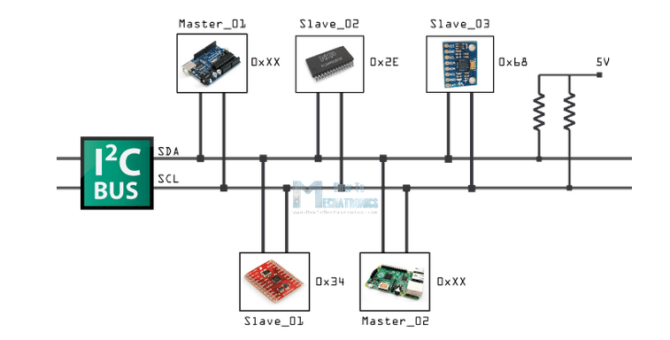
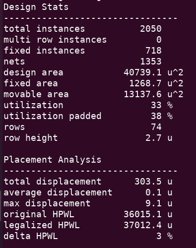
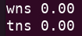
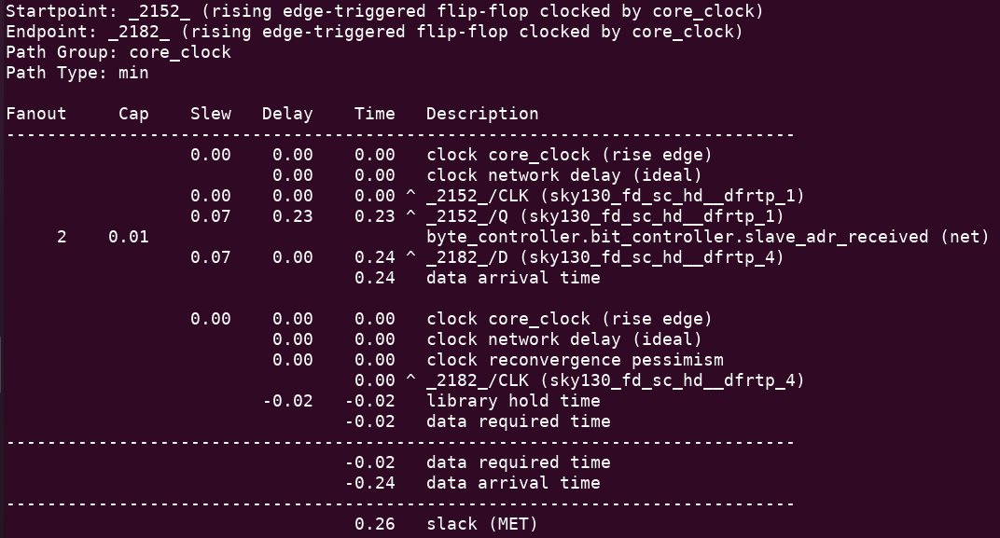
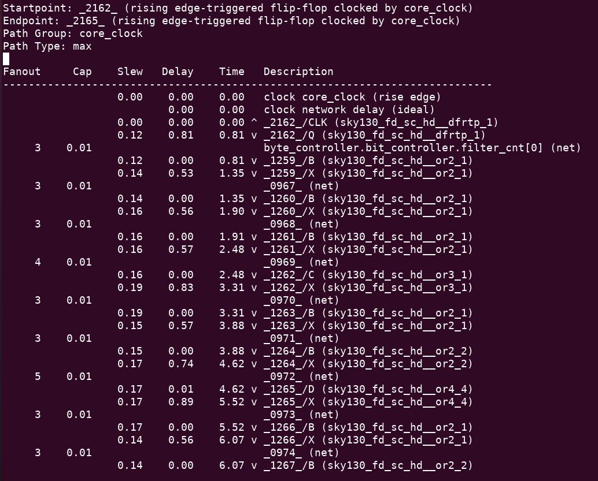
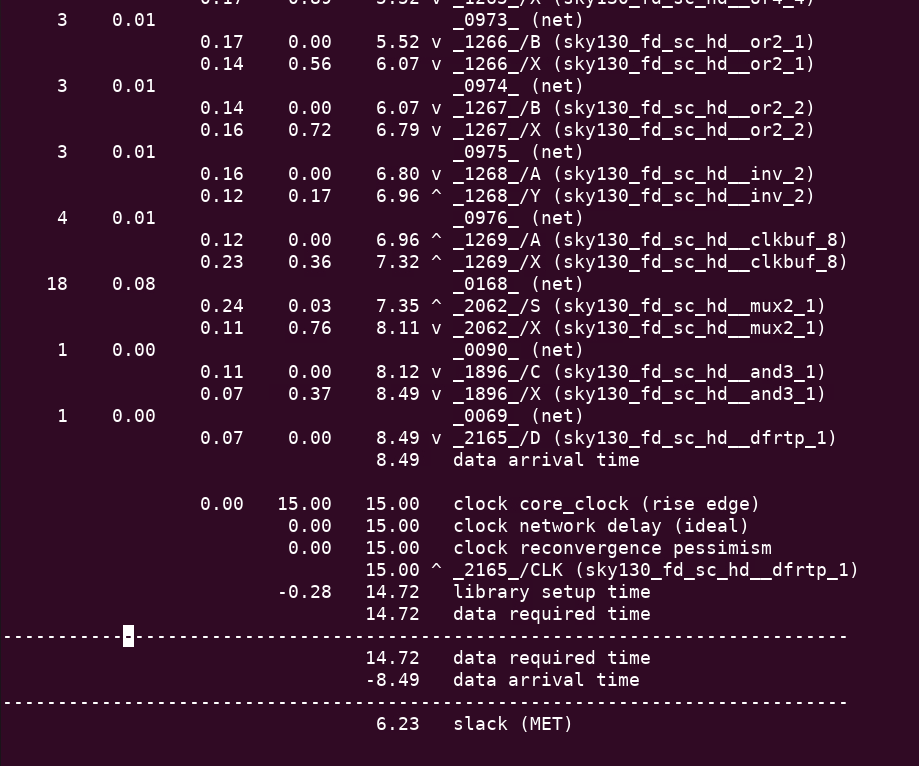
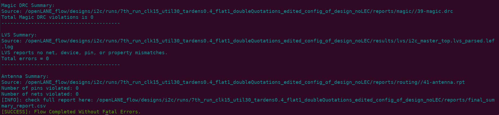
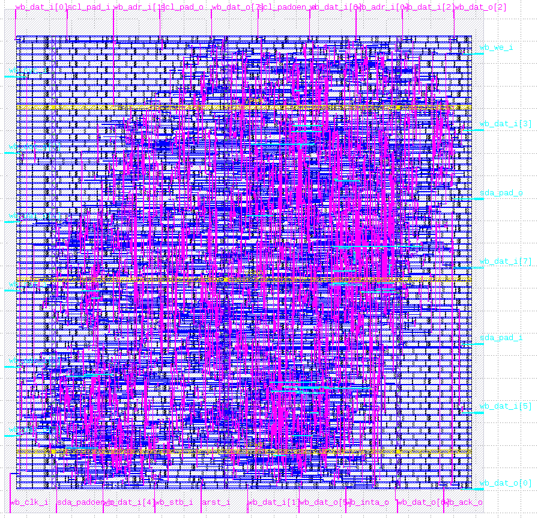

# i2c_updated
# **I2C implementation on Skywater 130nm**
## **Intro to I2C**
I2C is a device that is used to connect multiple masters-slaves having **2 connection** lines with each other and arrange between them for _reading/writing_ data.  
Basically, these 2 connection lines are **SDA** and **SCL**.  
The SDA and SCL lines initially are pulled up through resistors as the I2C is an open drain device _(i.e active low)_  
For any master to start _recieving (reading from a slave)/transmitting (writing on a slave)_, it should be the **first master to pull SDA line down**  
After that, the master sends the slave address that the master wants to communicate with _(7 bits address and 1 bit for read/write)_  
The slave then replies back by an _ACK/NACK_ signal  
If an ACK signal recieved, the master sends the slave’s register address _(8 bits)_ to _read from / write to_  
The slave then replies back by _ACK/NACK_ signal  
If an ACK signal recieved, the master begins to _send/recieve_ data in _8 bits_, then waiting for the _ACK/NACK_ signal after every _8 bits_ of data to decide what to do next **(either continue sending data on ACK signal OR decide how to proceed with the slave upon NACK signal is sent)**  
The **clock** signal on SCL line is generated through the I2C device

For more details to see visual signals click [here](https://howtomechatronics.com/tutorials/arduino/how-i2c-communication-works-and-how-to-use-it-with-arduino/) , you'll find a 10 minutes video explaining the way I2C works.

## **I2C PnR flow**

The PnR flow is done using **OpenLANE** tool and **sky130** PDK, the std cell library used is **sky130_fd_sc_hd**  
The PnR flow is basically starting from a ready verilog behavioral code which is synthesizable to do **synthesis** down to **chip finishing and STA**  
Here I ran the default flow of OpenLANE using **flow.tcl** script which automates all the flow steps by one command which is:  
./flow.tcl -design _<name_of_design_directory>_ -tag _<name_of_the_run>_  
I made 7 runs, 5 of them had some issue with the configuration with the tool and that made them all give identical results, so equivalently i made 3 different runs with some changes done to environmental variables to adjust the design and fix antenna issues.  
The 3 runs done without Logical Equivalence Check.  
### Flow Runs
|        Env Variables                           |    STA Violations    |DRC Violations|LVS Violations|Antenna Violations  |
|------------------------------------------------|----------------------|--------------|--------------|--------------------|
|clk=20ns fp util=35% target density=0.45|setup=0 hold=0    |  0           |     0        |pins:1 nets:1   |
|clk=15ns fp util=50% target density=0.55|setup=0 hold=0    |  0           |     0        |pins:4 nets:4   |
|clk=15ns fp util=30% target density=0.4 |setup=0 hold=0    |  0           |     0        |pins:0 nets:0   |

The clean run is the first run.
The screenshots for it are as follows:

#### Design stats and Placement analysis after cts:

#### The worst negative slack and total negative slack:

#### Worst hold timing slack

#### Worst setup timing slack

#### DRC LVS Antenna checks

#### Snap shot of the I2C design layout

